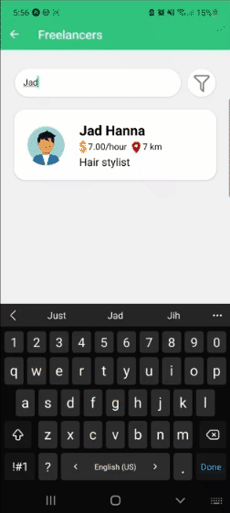

<div align="center">

> Hello world! This is the project’s summary that describes the project plain and simple, limited to the space available. 



</div>

<br><br>


> HireUp is a social app that allows users to find freelancers in many fields, offering a variety of services from small tasks like babysitting to bigger projects like UX/UI design, and filter them by rate/distance.
> 
> Users can easily offer their service in the same fields for a rate per hour.
> 
### User Stories
- As a user, I want to find freelancers in many fields, so that I can hire them.
- As a user, I want to search for freelancers by name and title, so that I find the one I want to contact.
- As a user, I want to filter freelancers by rate per hour and by distance, so it becomes easier to find the one I want to contact.
- As a user, I want to be able to contact freelancers available, so that I can hire them.
- As a user, I want to check the freelancers reviews, so that I can have an idea about them and their work.
- As a user, I want to be able to post my service, so that other users can hire me as well.
- As a user, I want to recieve messages from other users about possible opportunities, so that we can discuss the opportunity.

<br><br>


> The below screenshots show some aspects of the design that was planned before on paper, then moved to Figma app for the fine details.


| Login/Sign up  | Home/Freelancers in category  |
| -----------| -----|
|  ||

| Freelancer profile/Add review  | My profile/Edit work profile  |
| -----------------| -----|
|  |  |


<br><br>


Here's a brief high-level overview of the tech stack used in HireUp:

- React Native, a JavaScript framework for writing mobile applications.
- Laravel, a PHP framework. It follows a model-view-controller design pattern.
- MySQL, a relational database management system (RDBMS) that is based on structured query language (SQL).


<br><br>


> Using the above mentioned tech stacks and the wireframes build with figma from the user sotries we have, the implementation of the app is shown as below, these are some screenshots from the real app

| Sign up screen | Home screen |Search  |
|----------|-----------|-----------|
|  |  |  |


| Filter by maximum rate and distance| Freelancer profile | Whatsapp redirection|
| ------------|----------|----------|
| ||  | 

<br></br>
> Here's some short gifs from the real app


| Register| Home | Contact |Review|
| ------------|----------|-----------|-----------|
||  |  |  |

|Search |Filter |Filter |Add work profile |
|-----------|-----------|-----------|-----------|
|  |  |  |  |

<br><br>


>To get a local copy up and running follow these simple example steps.

### Prerequisites

* Download and install [Node.js](https://nodejs.org/en/)

* npm
  ```sh
  npm install npm@latest -g
  ```
* Expo CLI
  ```sh
  npm install --global expo-cli
  ```
* Expo Go mobile app
 

### Installation

1. Clone the repo
   ```sh
   git clone https://github.com/calineY/HireUp.git
2. Navigate to the Frontend folder and install dependencies
   ```sh
   cd HireUp/Frontend
   npm install
   ```
3. Run the start up command
   ```sh
   expo start
   ```
4. Scan the generated QR code with your camera (ios) or through the Expo Go application (android).

<!-- This is an example of how to list things you need to use the software and how to install them.
* npm
  ```sh
  npm install npm@latest -g
  ```

### Installation

_Below is an example of how you can instruct your audience on installing and setting up your app. This template doesn't rely on any external dependencies or services._

1. Get a free API Key at [https://example.com](https://example.com)
2. Clone the repo
   ```sh
   git clone https://github.com/your_username_/Project-Name.git
   ```
3. Install NPM packages
   ```sh
   npm install
   ```
4. Enter your API in `config.js`
   ```js
   const API_KEY = 'ENTER YOUR API';
   ```
 -->
